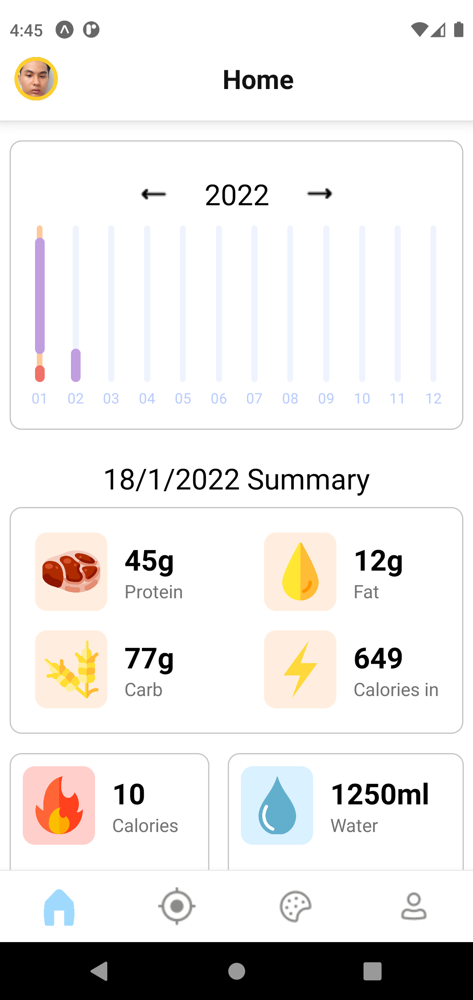
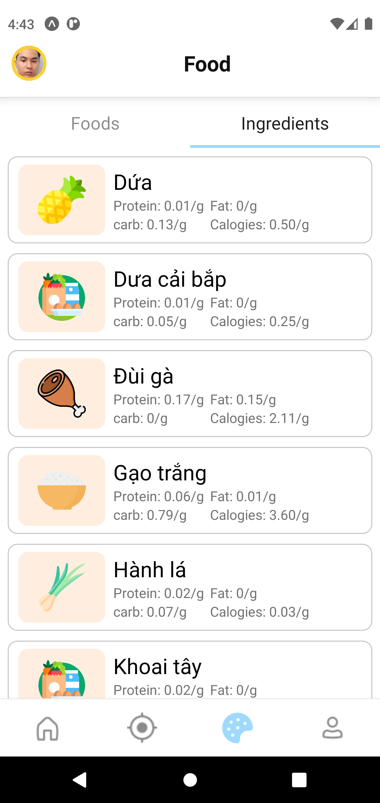
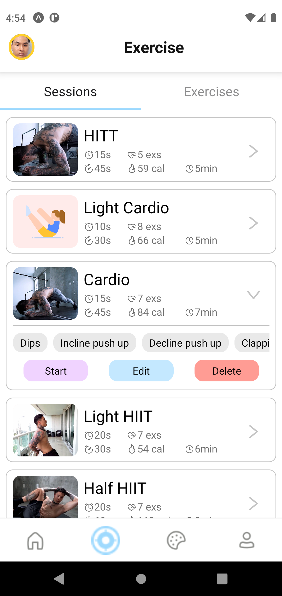
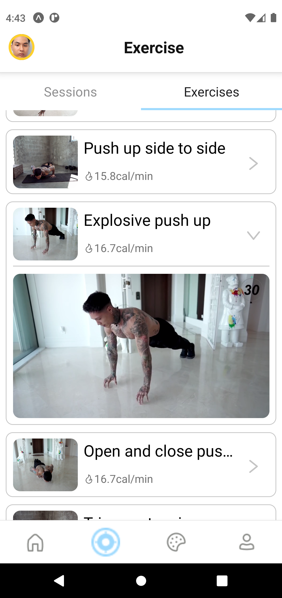

# INFO
- an app for active people who are interested in exercising and calories calculating at any time.
- This app provides food, sessions calories to you. Besides, you can do exercises following the instructions of this app
- This project is built by expo

# RUN
<!-- S1:   -->
- Turn on 2 terminal
- SERVER: 'cd ./server' -> 'npm start'
- CLIENT: 'cd ./Ultifit' -> 'npm start' (open in Android emulators)

<!-- S2:  
- Mail me and I will send you apk file
- My mail: phuongnam.infl@gmail.com -->

# DEMO IMAGES
- Home screen

- Account screen

- Foods screen

- Ingredients screen

- Sessions screen

- Exercises screen

# Note
- This is VIP account
